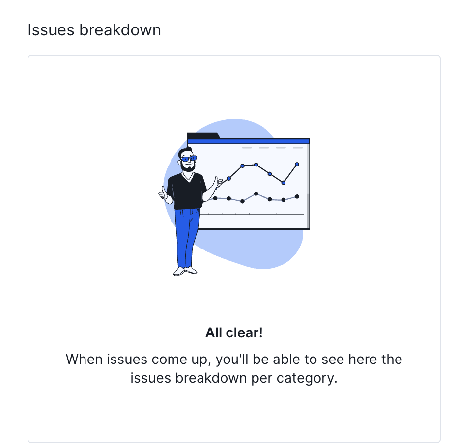
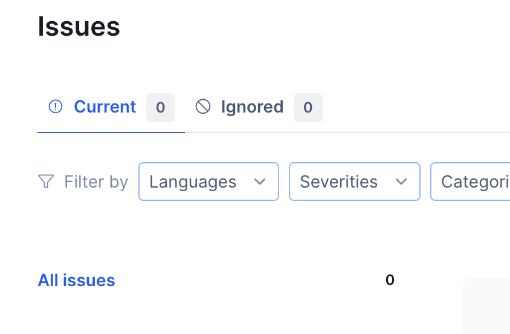

# Testing and Code Review

## 1. Change History

| **Change Date** | **Modified Sections** | **Rationale** |
|-----------------|-----------------------|---------------|
| _Nothing to show_ | | |

---

## 2. Back-end Test Specification: APIs

### 2.1. Locations of Back-end Tests and Instructions to Run Them

#### 2.1.1. Tests

##### Notes API

| Interface | Describe Group Location, No Mocks | Describe Group Location, With Mocks | Mocked Components |
|---|---|---|---|
| POST `/api/notes` | `backend/src/__tests__/unmocked/notes.normal.test.ts#L40` | `backend/src/__tests__/mocked/notes.mocked.test.ts#L51` | `noteService.createNote`, OpenAI embeddings client |
| PUT `/api/notes/:id` | `#L282` | `#L202` | `noteService.updateNoteById` |
| DELETE `/api/notes/:id` | `#L398` | `#L298` | `noteService.deleteNote` |
| GET `/api/notes/:id` | `#L462` | `#L253` | `noteService.getNoteById` |
| GET `/api/notes` | `#L528` | `#L343` | `noteService.searchNotes`, OpenAI embeddings |
| GET `/api/notes/:id/workspaces` | `#L893` | `#L620` | `workspaceModel.findById` |
| POST `/api/notes/:id/share` | `#L662` | `#L665` | `noteService.shareNoteToWorkspace`, `workspaceModel` |
| POST `/api/notes/:id/copy` | `#L784` | `#L764` | `noteService.copyNote`, `workspaceModel` |

##### Workspaces API

| Interface | Describe Group Location, No Mocks | Describe Group Location, With Mocks | Mocked Components |
|---|---|---|---|
| POST `/api/workspace` | `backend/src/__tests__/unmocked/workspace.normal.test.ts#L45` | `backend/src/__tests__/mocked/workspace.mocked.test.ts#L237` | `workspaceService.createWorkspace` |
| GET `/api/workspace/personal` | `#L167` | `#L277` | `workspaceService.getPersonalWorkspaces` |
| GET `/api/workspace/user` | `#L290` | `#L330` | `workspaceService.getUserWorkspaces` |
| GET `/api/workspace/:id` | `#L352` | `#L364` | `workspaceService.getWorkspaceById` |
| GET `/api/workspace/:id/members` | `#L410` | `#L398` | `workspaceService.getMembers`, `notificationService` |
| GET `/api/workspace/:id/tags` | `#L454` | `#L448` | `workspaceService.getWorkspaceTags` |
| GET `/api/workspace/:id/membership/:userId` | `#L536` | `#L482` | `workspaceService.getMembership` |
| POST `/api/workspace/:id/members` | `#L619` | `#L516` | `workspaceService.addMembers`, `notificationService` |
| POST `/api/workspace/:id/leave` | `#L847` | `#L694` | `workspaceService.leaveWorkspace` |
| PUT `/api/workspace/:id` | `#L959` | `#L712` | `workspaceService.updateWorkspace` |
| PUT `/api/workspace/:id/picture` | `#L1051` | `#L748` | `workspaceService.updateWorkspacePicture`, `storage` |
| DELETE `/api/workspace/:id/members/:userId` | `#L1156` | `#L784` | `workspaceService.removeMember` |
| DELETE `/api/workspace/:id` | `#L1323` | `#L818` | `workspaceService.deleteWorkspace`, `notificationService` |
| GET `/api/workspace/:id/poll` | `#L1429` | `#L852` | `workspaceService.getWorkspaceWithPolling` |

##### Authentication API

| Interface | Describe Group Location, No Mocks | Describe Group Location, With Mocks | Mocked Components |
|---|---|---|---|
| POST `/api/auth/signup` | `backend/src/__tests__/unmocked/auth.normal.test.ts#L123` | `backend/src/__tests__/mocked/auth.mocked.test.ts#L74` | `authService.signUp`, Google token verifier, `workspaceService` |
| POST `/api/auth/signin` | `#L151` | `#L290` | `authService.signIn` |
| POST `/api/auth/dev-login` | `#L68` | `#L394` | `authService.devLogin` |

##### User API

| Interface | Describe Group Location, No Mocks | Describe Group Location, With Mocks | Mocked Components |
|---|---|---|---|
| GET `/api/users/profile` | `backend/src/__tests__/unmocked/user.normal.test.ts#L39` | — | — |
| PUT `/api/users/profile` | `#L57` | `backend/src/__tests__/mocked/user.mocked.test.ts#L48` | `userModel.updateOne`, `workspaceModel` |
| DELETE `/api/users/profile` | `#L166` | `#L104` | `workspaceModel`, notification service |
| POST `/api/users/fcm-token` | `#L230` | `#L155` | `userModel.updateOne` |
| GET `/api/users/:id` | `#L273` | `#L209` | `userModel.findById` |
| GET `/api/users/email/:email` | `#L318` | `#L260` | `userModel.findByEmail` |

##### Message API

| Interface | Describe Group Location, No Mocks | Describe Group Location, With Mocks | Mocked Components |
|---|---|---|---|
| GET `/api/messages/workspace/:workspaceId` | `backend/src/__tests__/unmocked/message.normal.test.ts#L61` | `backend/src/__tests__/mocked/message.mocked.test.ts#L67` | `messageModel.findByWorkspace` |
| POST `/api/messages/workspace/:workspaceId` | `#L188` | `#L91` | `messageModel.create`, `workspaceModel` |
| DELETE `/api/messages/:messageId` | `#L261` | `#L134` | `messageModel.deleteOne` |

##### Media API

| Interface | Describe Group Location, No Mocks | Describe Group Location, With Mocks | Mocked Components |
|---|---|---|---|
| POST `/api/media/upload` | `backend/src/__tests__/unmocked/media.normal.test.ts#L56` | `backend/src/__tests__/mocked/media.mocked.test.ts#L55` | `storage.uploadImage`, file system stubs |

#### 2.1.2. Commit Hash Where Tests Run
`c5f46d61177b82ff74c9c30dfd32a5e24de5d683`

#### 2.1.3. How to Run the Tests

1. `cd backend`
2. `npm install`
3. `npm test`

---

### 2.2. GitHub Actions Configuration Location
`~/.github/workflows/backend-tests.yml`

### 2.3. Jest Coverage Report Screenshots (Without Mocking)

### 2.4. Jest Coverage Report Screenshots (With Mocking)

### 2.5. Combined Jest Coverage Reports (With & Without Mocking)

---

## 3. Back-end Non-functional Requirements

### 3.1. Test Locations

| **Non-Functional Requirement** | **Location in Git** |
|---|---|
| Backend – Search Speed | `ThingSpace.ts/backend/src/__tests__/notes.latency.test.ts` |
| Frontend – Two-Click Navigation | `frontend/app/src/androidTest/java/com/cpen321/usermanagement/TestReachWithTwoClicks.kt` |

#### Backend – Search Speed (`notes.latency.test.ts`)
- **How to run:** `cd backend && npm test -- __tests__/non-func-tests`
- **What it checks:** Seeds 400 notes, issues three representative search queries, and reports the mean latency. Latest runs average ~1.1s/query, comfortably under the 5s budget.

#### Frontend – Two-Click Navigation (`TestReachWithTwoClicks.kt`)
- **How to run:** `cd frontend && ./gradlew connectedAndroidTest -Pandroid.testInstrumentationRunnerArguments.class=com.cpen321.usermanagement.TestReachWithTwoClicks`
- **What it checks:** Starting from the main workspace screen, the test traverses to note, template, and chat views—both within the current workspace and across other workspaces—counting taps to confirm every note-bearing screen is reachable in ≤2 clicks.

### 3.2. Test Verification and Logs

#### Performance: Search Speed

- Creates 400 notes, runs 3 queries, average ~1.1s (<5s target)
- Logs:

<Place final print screens here>

#### Chat Data Security

- Verification:
- Logs:

<Place final print screens here>

---

## 4. Front-end Test Specification
This includes the non-functional requirement that every note/message containing screen must be reachable from the main screen within two clicks. This non-functional requirement can only be verified via frontend tests, hence it is included here as `TestReachWith2Clicks.kt`.

### 4.1. Location in Git
`./frontend/app/src/androidTest/java/com.cpen321.usermanagement`

### 4.2. Tests Included
#### TestCollaborate.kt – Collaborate Feature
- **Prerequisites**
  - Two user accounts: a workspace manager and a workspace member
  - The manager account must have a workspace named `Test`
  - The manager account must not have access to workspaces named `Study` or `Study v2`

---

### Create Workspace

| Scenario steps | Test case steps |
|----------------|----------------|
| 1. The user opens the “Create Workspace” screen. | Open the “Create Workspace” screen. |
| 2. The app shows input fields for title and a “Create Workspace” button that is disabled. | Check that the “Pick a workspace name” field is visible. Check that button labelled “Create Workspace” is present and disabled. |
| 3a. The user inputs a workspace title that is already taken | Before the test, a separate workspace called “Test” should be created. Then, open the “Create Workspace” screen and input “Test” in the title field. Click “Create”. |
| 3a1. The app displays an error message telling user that the creation failed | Check the dialog shows: “Failed to create workspace.” |
| 3. The user enters valid information. | Input “Studies” in the title field. Check that button labelled “Create” is now enabled. |
| 4. The user clicks the “Create” button. | Click “Create”. Verify system shows “Manage Workspace Profile” for user to make edits and that the “Save” button is disabled until a workspace bio is inputted. Verify workspace “Studies” appears in the workspace list. |

---

### Update Workspace (Manager)

| Scenario steps | Test case steps |
|----------------|----------------|
| 10. The manager navigates to the “Edit Workspace” icon. | As the workspace manager account, navigate to the workspace screen. Click the “Pencil” icon next to the “Studies” workspace. |
| 11. The manager edits the title and bio. | Change title to “Studies v2” and the bio to “Study group” and click the “Save” button. Check the confirmation message: “Profile updated successfully.” |

---

### Invite to Workspace

| Scenario steps | Test case steps |
|----------------|----------------|
| 5. A workspace member selects “Invite User”. | Click “Studies” workspace’s “Manage Workspace” icon (pencil icon). Click the “Invite User” icon on the bottom navbar (icon with person and cogwheel). |
| 6. The app shows an input field for email and a “Invite to the Workspace” button. | Check input field and “Invite to the Workspace” button are visible. |
| 7a. The inviter inputs invalid email. | Input “invalidemail” and click “Invite to the workspace”. |
| 7a1. The app displays an error message about no user with the email existing | Check message: “Could not retrieve profile matching the given email!” |
| 7. The inviter inputs a valid email | Input the email of another account (your teammate’s account on the app). Click the “Invite to the Workspace” button. Check the confirmation message: “The user got added to the workspace.” |
| 7b. The invitee is already in the workspace. | Input the email of the teammate already in the workspace and click “Invite to the workspace”. |
| 7b1. The app displays an error message indicating that the invitee is already in the workspace. | Check message: “The user is already a member!” |

---

### Send Chat Message

| Scenario steps | Test case steps |
|----------------|----------------|
| 8. The user opens workspace chat. | Go to Workspaces Screen. Click the “Chat” icon next to the “Studies” workspace. Check that the system displays the workspace chat screen. |
| 9a. The message is empty. | Leave input blank or simply spaces and click the “Send” icon. Check that nothing occurs in the chat screen. |
| 9. The user types a valid message and presses send. | Input “Hello team!” in the chat box and click the “Send” icon. Check the chat log shows “Hello team!” with the sender's profile picture and timestamp. |

---

### Update Workspace (Non-Manager)

| Scenario steps | Test case steps |
|----------------|----------------|
| 10a. A non-manager user attempts to update the workspace. | Log in as a non-manager user and navigate to the “Edit Workspace” icon. Check that the input fields are greyed out. |

---

### Leave Workspace (Non-Manager)

| Scenario steps | Test case steps |
|----------------|----------------|
| 12. The user (non-manager) selects “Leave Workspace”. | Open “Studies” manage workspace screen (pencil icon) using your non-manager account and click “Leave Workspace” (door icon). |
| 13. App removes user from the workspace | Check that the “Studies” workspace doesn’t show up in the workspace list screen. |

---

### Ban Users

| Scenario steps | Test case steps |
|----------------|----------------|
| 14. The manager opens the Members screen (Profile icon in manage workspace screen). | “Studies” workspace → Manage Workspace → Members screen (profile icon). |
| 15. Manager chooses the user to ban | Click the trash bin icon next to the user. |
| 16. App bans user from the workspace permanently | Verify the banned user doesn’t show up in the Members screen anymore. Verify the user cannot be invited anymore and system shows an error message: “This user is banned.” |

---

### Delete Workspace (Manager)

| Scenario steps | Test case steps |
|----------------|----------------|
| 17. The manager selects “Delete Workspace”. | Open “Studies” settings and click “Delete Workspace” (trash bin icon). |
| 18. App deletes the workspace | Verify the workspace “Studies” doesn’t show up in the workspace list screen. Verify the workspace “Studies” can be created. |

Logs:

Test of the non-functional requirement that every note-containing screen is reachable from the main screen within two clicks or fewer (`TestReachWith2Clicks.kt`). Starting at the main content screen in a workspace, the test navigates to templates or chat screens in the current workspace, as well as content, templates, or chat in other workspaces. Each route tracks the number of taps performed and asserts that the destination is reached in two clicks or less.

<Place final print screens here>

---

## 5. Automated Code Review Results

### 5.1. Commit Hash Where Codacy Ran
`c5f46d61177b82ff74c9c30dfd32a5e24de5d683`

### 5.2. Unfixed Issues per Codacy Category

### 5.3. Unfixed Issues per Codacy Code Pattern

### 5.4. Justifications for Unfixed Issues

- **Usage of Deprecated Modules**
  - Location: `src/services/chatService.js#L31`
  - Justification: 

---
