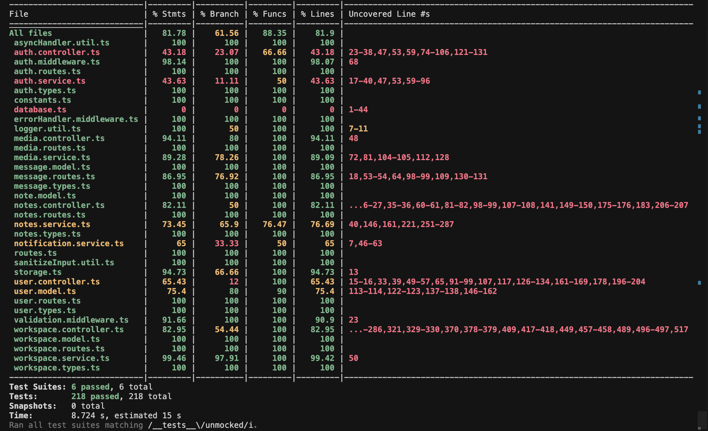
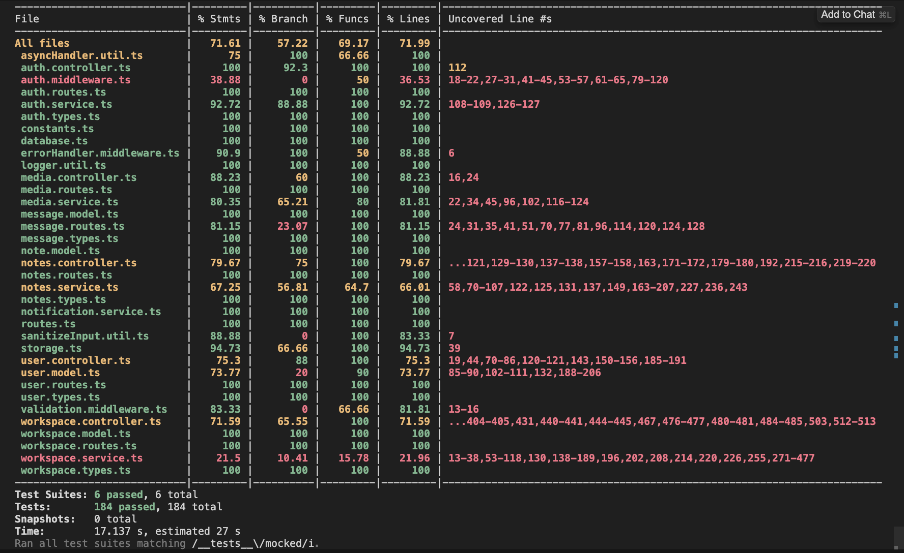
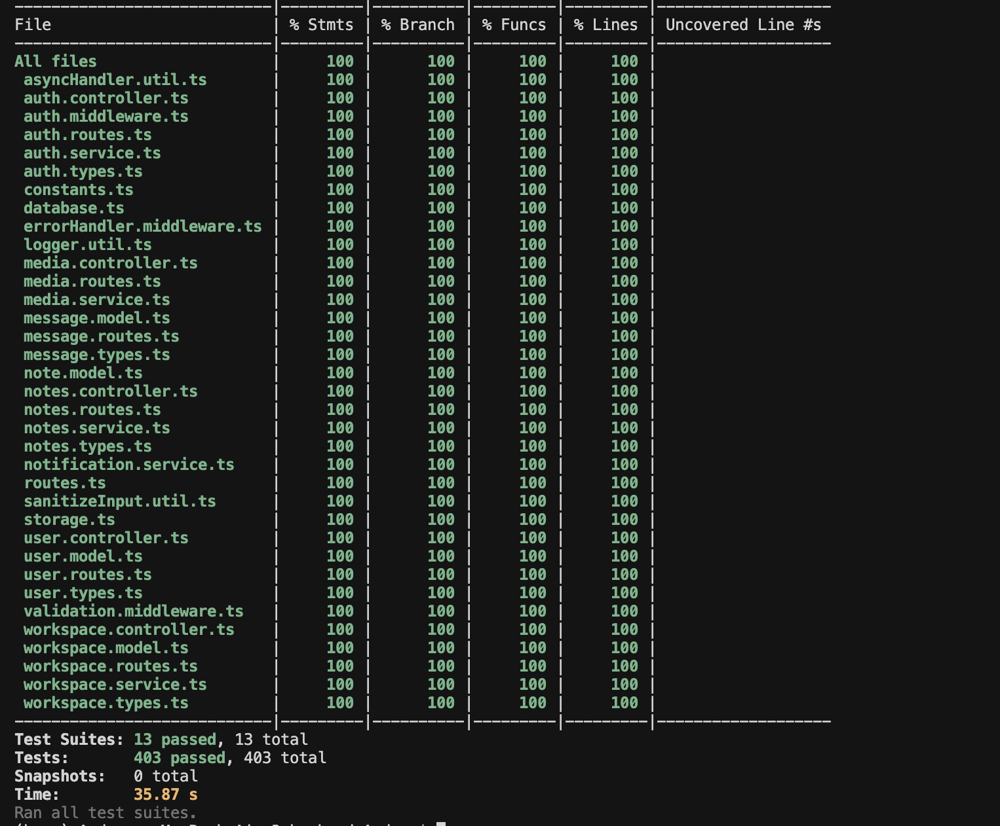

# Testing and Code Review

## 1. Change History

| **Change Date** | **Modified Sections** | **Rationale** |
|-----------------|-----------------------|---------------|
| _Nothing to show_ | | |

---

## 2. Back-end Test Specification: APIs

### 2.1. Locations of Back-end Tests and Instructions to Run Them

#### 2.1.1. Tests

##### Notes API

| **Interface** | **No Mocks** | **With Mocks** | **Mocked Components** |
|---|---|---|---|
| **POST /api/notes** | `src/tests/notes.normal.test.ts#L38` | `src/tests/notes.mocked.test.ts#L63` | Notes Service, Notes DB, OpenAI API |
| **PUT /api/notes/:id** | `L135` | `L85` | Notes Service |
| **DELETE /api/notes/:id** | `L197` | `L116` | Notes Service |
| **GET /api/notes/:id** | `L248` | `L102` | Notes Service, Notes DB |
| **GET /api/notes** | `L301` | `L130,147` | Notes Service, Workspace DB, OpenAI API |
| **GET /api/notes/:id/workspaces** | `L605` | `L280` | Notes Service |
| **POST /api/notes/:id/share** | `L402` | `L294,541,623` | Notes Service, Notes DB, Workspace DB |
| **POST /api/notes/:id/copy** | `L510` | `L311,328,566` | Notes Service, Notes DB |

##### Workspaces API

| **Interface** | **No Mocks** | **With Mocks** | **Mocked Components** |
|---|---|---|---|
| **POST /api/workspaces** | `src/tests/workspace.normal.test.ts#L41` | `L44` | Workspace Service |
| **GET /api/workspaces/personal** | `L101` | `L84` | Workspace Service |
| **GET /api/workspaces/user** | `L183` | `L118` | Workspace Service |
| **GET /api/workspaces/:id** | `L231` | `L152` | Workspace Service |
| **GET /api/workspaces/:id/members** | `L275` | `L186` | Workspace Service |
| **GET /api/workspaces/:id/tags** | `L306` | `L236` | Workspace Service |
| **GET /api/workspaces/:id/membership/:userId** | `L441` | `L270` | Workspace Service |
| **POST /api/workspaces/:id/members** | `L524` | `L304` | Workspace Service |
| **POST /api/workspaces/:id/leave** | `L738` | `L374` | Workspace Service |
| **PUT /api/workspaces/:id** | `L836` | `L392` | Workspace Service |
| **PUT /api/workspaces/:id/picture** | `L897` | `L428` | Workspace Service |
| **DELETE /api/workspaces/:id/members/:userId** | `L955` | `L464` | Workspace Service |
| **DELETE /api/workspaces/:id** | `L1112` | `L498` | Workspace Service |
| **GET /api/workspaces/:id/poll** | `L1204` | `L532` | Workspace Service |

##### Authentication API

| **Interface** | **No Mocks** | **With Mocks** | **Mocked Components** |
|---|---|---|---|
| **POST /api/auth/signup** | `src/tests/auth.normal.test.ts#L123` | `L77` | Auth Service, Workspace Service, User DB, Google OAuth |
| **POST /api/auth/signin** | `L151` | `L290` | Auth Service |
| **POST /api/auth/dev-login** | `L68` | `L394` | Auth Service |

##### User API

| **Interface** | **No Mocks** | **With Mocks** | **Mocked Components** |
|---|---|---|---|
| **GET /api/users/profile** | `src/tests/user.normal.test.ts#L39` | — | — |
| **PUT /api/users/profile** | `L57` | `L48` | User DB, Workspace DB |
| **DELETE /api/users/profile** | `L166` | `L104` | Workspace DB |
| **POST /api/users/fcm-token** | `L230` | `L155` | User DB |
| **GET /api/users/:id** | `L273` | `L209` | User DB |
| **GET /api/users/email/:email** | `L318` | `L260` | User DB |

##### Message API

| **Interface** | **No Mocks** | **With Mocks** | **Mocked Components** |
|---|---|---|---|
| **GET /api/messages/workspace/:workspaceId** | `src/tests/message.normal.test.ts#L61` | `L67` | Message DB |
| **POST /api/messages/workspace/:workspaceId** | `L188` | `L91` | Message DB, Workspace DB |
| **DELETE /api/messages/:messageId** | `L261` | `L134` | Message DB, Workspace DB |

##### Media API

| **Interface** | **No Mocks** | **With Mocks** | **Mocked Components** |
|---|---|---|---|
| **POST /api/media/upload** | `src/tests/media.normal.test.ts#L56` | `L55` | Media Service, File System |

#### 2.1.2. Commit Hash Where Tests Run
` `

#### 2.1.3. How to Run the Tests

1. `cd backend`
2. `npm install`
3. `npm test`

---

### 2.2. GitHub Actions Configuration Location

`~/.github/workflows/backend-tests.yml`

### 2.3. Jest Coverage Report Screenshots (Without Mocking)

### 2.4. Jest Coverage Report Screenshots (With Mocking)

### 2.5. Combined Jest Coverage Reports (With & Without Mocking)

---

## 3. Back-end Non-functional Requirements

### 3.1. Test Locations

| **Non-Functional Requirement** | **Location in Git** |
|---|---|
| Search Speed | `ThingSpace.ts/backend/src/__tests__/notes.latency.test.ts` |

### 3.2. Test Verification and Logs

#### Performance: Search Speed

- Creates 400 notes, runs 3 queries, average ~1.1s (<5s target)
- Logs:

<Place final print screens here>

#### Chat Data Security

- Verification:
- Logs:

<Place final print screens here>

---

## 4. Front-end Test Specification
This includes the non-functional requirement that every note/message containing screen must be reachable from the main screen within two clicks. This non-functional requirement can only be verified via frontend tests, hence it is included here as `TestReachWith2Clicks.kt`.

### 4.1. Location in Git
`./frontend/app/src/androidTest/java/com.cpen321.usermanagement`

### 4.2. Tests Included
#### TestCollaborate.kt – Collaborate Feature
- **Prerequisites**
  - Two user accounts: a workspace manager and a workspace member
  - The manager account must have a workspace named `Test`
  - The manager account must not have access to workspaces named `Study` or `Study v2`

| Use Case | Test File |
|---|---|
| Collaborate | `TestCollaborate.kt` |
| Manage Notes | `TestNotes.kt` |
| Retrieve Notes | `TestRetrieveNotes.kt` |
| Reach Note Screens in ≤2 Clicks | `TestReachWith2Clicks.kt` |

Logs:

<Place final print screens here>

---

## 5. Automated Code Review Results

### 5.1. Commit Hash Where Codacy Ran
` `

### 5.2. Unfixed Issues per Codacy Category
_(Placeholder)_

### 5.3. Unfixed Issues per Codacy Code Pattern
_(Placeholder)_

### 5.4. Justifications for Unfixed Issues

- **Usage of Deprecated Modules**
  - Location: `src/services/chatService.js#L31`
  - Justification: 

---
